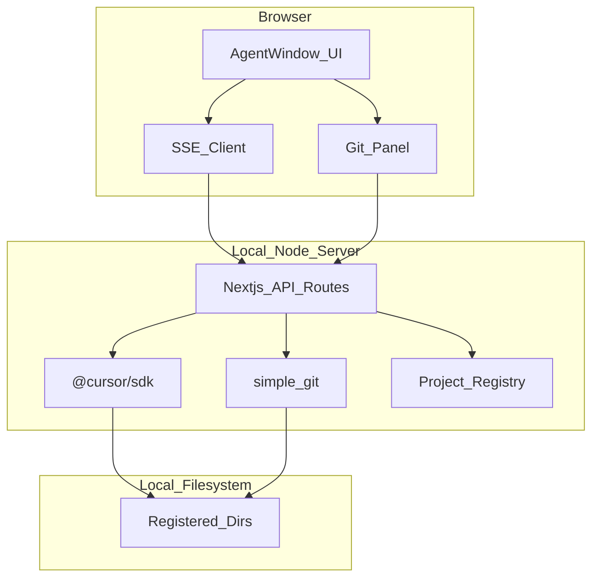

# cursor-agent-web

> Cursor Agent Window 的 Web 版 — 在浏览器中驱动真实 Cursor Agent，管理本地项目与 Git。

**cursor-agent-web** 是在浏览器中复刻 [Cursor Agent Window](https://cursor.com) 体验的本地优先 Web 应用。它通过 Node 服务端集成 [`@cursor/sdk`](https://cursor.com/docs/sdk/typescript)，驱动与 Cursor IDE 相同的 Agent，并对用户注册的本地项目目录提供完整 Git 操作。

---

## 核心能力

- **Agent 对话** — 创建会话、选择模型、流式收发消息与工具调用
- **本地项目管理** — 注册本机目录作为工作区，侧边栏按项目分组展示会话
- **完整 Git** — status、diff、branch、commit、push/pull 等（详见 [PRD](docs/PRD.md)）
- **深色 UI** — 与 Cursor Agent Window 一致的布局与视觉风格

---

## 架构



**运行模式**：本地优先（`localhost`）。服务端必须跑在你的机器上，才能通过 SDK `local: { cwd }` 访问真实工作区并执行 Git 命令。

---

## 环境要求

| 依赖 | 版本 | 说明 |
|------|------|------|
| Node.js | 20+ | SDK 为 Node-first，含 native 依赖 |
| Git | 2.x+ | 命令行可用 |
| Cursor API Key | — | 从 [Dashboard → Integrations](https://cursor.com/dashboard/integrations) 获取 |

---

## 快速开始

```bash
cd ~/cursor-agent-web

# 配置 API Key（必须）
cp .env.example .env
# 编辑 .env，填入 CURSOR_API_KEY

npm install
npm run dev

# 打开 http://localhost:3000
# 1. 侧边栏点击「添加本地目录」，填入项目绝对路径
# 2. 在输入框发送 prompt，即可流式对话
# 3. 顶栏或侧边栏点击 Git，管理变更/提交/分支
# 4. 输入 / 唤起技能菜单，@ 引用项目文件；侧边栏可恢复历史会话
```

---

## 项目结构

```
cursor-agent-web/
├── README.md
├── docs/
│   └── PRD.md              # 产品需求文档
├── package.json            # M1 创建
├── next.config.ts
├── tailwind.config.ts
├── src/
│   ├── app/                # Next.js 页面与 API routes
│   ├── components/         # UI 组件
│   │   ├── Sidebar.tsx
│   │   ├── PromptInput.tsx
│   │   ├── MessageStream.tsx
│   │   ├── GitPanel.tsx
│   │   └── ...
│   ├── lib/
│   │   ├── sdk/            # Agent 封装（create, send, stream, resume）
│   │   ├── git/            # Git 服务层
│   │   └── projects/       # 项目注册表
│   └── types/
├── .env.example
└── .gitignore
```

---

## 开发路线图

| 阶段 | 交付物 | 状态 |
|------|--------|------|
| M0 立项 | PRD + README + git init | 完成 |
| M1 骨架 | Next.js 脚手架、深色 UI 壳 | 完成 |
| M2 Agent | SDK 集成、流式对话、项目管理 API | 完成 |
| M3 Git | Git 面板 + 完整命令封装 | 完成 |
| M4 打磨 | @/ 菜单、错误处理、会话恢复 | 完成 |
| P2 扩展 | Cloud、Automations、Customize、语音、分屏 | **完成** |

详细功能分级与 API 设计见 [docs/PRD.md](docs/PRD.md)。

---

## 安全说明

- **本地服务**：仅在 `localhost` 运行，不暴露到公网
- **路径白名单**：所有文件与 Git 操作限定在用户注册的目录内
- **API Key**：通过环境变量注入，**切勿提交到版本库**
- **工具调用**：SDK 本地模式默认自动执行 shell/edit，无人工审批（见 PRD 风险章节）

---

## License

MIT
