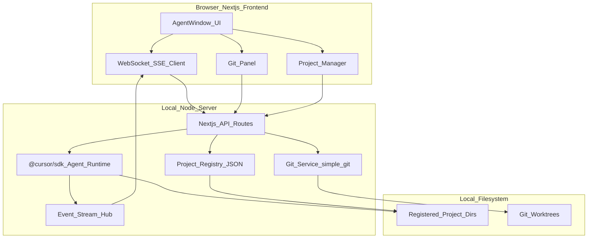

# Cursor Agent Window Web 版 — 产品需求文档（PRD）

> 版本：v0.1  
> 日期：2026-06-08  
> 状态：M3 完成，M4 待开始

---

## 1. 背景与目标

### 1.1 背景

Cursor Agent Window 是 Cursor 桌面端的核心交互界面，提供侧边栏项目导航、Agent 对话输入、模型选择、会话管理等能力。用户希望在浏览器中获得与之等价的体验，同时能够：

- 通过服务端集成 `@cursor/sdk`，驱动**真实的 Cursor Agent**（非模拟对话）
- 管理本地项目目录，并在 Web 界面中完成**完整 Git 操作**
- 在 `localhost` 环境下运行，直接访问本机文件系统

### 1.2 产品定位

**一句话**：在浏览器中复刻 Cursor Agent Window 的体验，通过本地 Node 服务调用 `@cursor/sdk` 驱动真实 Agent，并对用户注册的本地项目目录提供完整 Git 操作。

这不是纯静态 UI 克隆，而是**本地 Agent 控制台**。

### 1.3 成功标准

用户能够完成以下完整流程：

1. 添加一个本地项目目录（绝对路径）
2. 在该项目下创建新 Agent 会话
3. 选择模型并发送 prompt
4. 在浏览器中流式看到 Agent 回复与工具调用
5. 在同一界面查看 Git 状态、diff、提交变更

---

## 2. 用户画像

| 画像 | 描述 | 核心诉求 |
|------|------|----------|
| 个人开发者 | 管理多个本地 repo，频繁切换项目 | 快速开新 Agent、查看分支状态 |
| Pro 用户 | 已订阅 Cursor Pro，熟悉 Agent Window | UI 体验一致、模型与技能可用 |
| 自动化爱好者 | 希望后续对接 Automations | 预留入口，未来可扩展 |

---

## 3. 参考 UI 与视觉规范

基于 Cursor Agent Window 桌面版界面拆解：

| 区域 | 元素 | 优先级 |
|------|------|--------|
| 左侧边栏 | New Agent、Automations、Customize、仓库/会话树、用户区 | P0 |
| 主区域顶栏 | Home/项目切换、Local 状态、Editor Window 外链、更多菜单 | P1 |
| 主区域中心 | 大输入框（Plan, Build, / skills, @ context）、模型选择器、语音入口 | P0 |
| 主区域底部 | Plan New Idea 快捷入口、Automations 提示文案 | P1 |
| 对话态 | 消息流、工具调用展示、流式输出、取消/重试 | P0 |

**视觉规范**：

- 深色主题（near-black 背景 + 深灰层级）
- 圆角输入框、药丸形快捷按钮
- Lucide 风格线性图标
- 宽松间距，与 Cursor Agent Window 保持一致的视觉层级

---

## 4. 功能需求

### 4.1 P0 — MVP 必须

#### 4.1.1 项目管理

- 添加本地目录：用户输入绝对路径，服务端校验路径存在且为目录
- 移除已注册目录（不删除磁盘文件）
- 展示已注册项目列表，按 `lastOpenedAt` 排序
- 每个项目显示名称（目录名）与路径
- 拒绝路径逃逸：所有操作限定在注册目录内，禁止 `../` 穿越

#### 4.1.2 Agent 会话

- **New Agent**：为当前选中项目创建新会话
- **模型选择**：调用 `Cursor.models.list()` 获取可用模型列表，默认 `composer-2.5`
- **发送 prompt**：`Agent.create` + `agent.send` + `run.stream()` 流式推送 `SDKMessage` 到前端
- **终态处理**：`run.wait()` 获取 `RunResult`，区分 `finished` / `error` / `cancelled`
- **会话恢复**：`Agent.resume(agentId)` 恢复历史会话
- **多轮对话**：同一会话内 follow-up 保持上下文
- **显式 Local runtime**：每次 `Agent.create` 必须传 `local: { cwd: projectPath }`

#### 4.1.3 侧边栏

- 项目树：按文件夹分组展示已注册项目
- 会话列表：每个项目下展示 Agent 会话，显示标题与时间
- New Agent 按钮（快捷键提示 `⌘N`）
- Automations、Customize 入口（P0 可为占位，P2 实现）

#### 4.1.4 基础 Git

| 操作 | 说明 |
|------|------|
| `status` | 展示 staged / unstaged / untracked 文件列表 |
| `diff` | 查看 staged 与 unstaged 差异 |
| `log` | 提交历史（最近 N 条） |
| `branch` | 列出本地与远程分支 |
| `checkout` | 切换分支 |
| `stage` | 暂存指定文件或全部 |
| `commit` | 提交（校验 commit message 非空） |

### 4.2 P1 — 第一版完整

#### 4.2.1 完整 Git

- `pull` / `push` / `fetch`
- `merge`（含冲突状态展示）
- `stash` / `stash pop`
- `remote` 查看
- 冲突文件高亮与 diff 预览

#### 4.2.2 顶栏

- Home / 项目切换下拉
- Local 状态指示器（绿色圆点 + "Local" 文案）
- Editor Window 外链（`cursor://` 或 `vscode://` 协议打开当前项目）
- 更多菜单（设置、关于）

#### 4.2.3 输入增强

- `/` 技能菜单：弹出可用 skills 列表
- `@` 上下文引用：基于注册路径的文件/目录 picker
- Plan New Idea：预填 plan 类 prompt 模板

#### 4.2.4 Run 管理

- 取消运行：`run.cancel()`（需 `run.supports("cancel")` 守卫）
- 错误态区分：
  - `CursorAgentError`（启动失败：认证、配置、网络）→ 提示重试
  - `result.status === "error"`（运行中失败）→ 展示 transcript
- 日志 `run.id` 与 `agent.agentId` 便于排查

### 4.3 P2 — 后续

- Automations 入口（对接 Cursor Automations 或自建 cron）
- Customize（规则/技能配置 UI）
- Cloud runtime 可选（`cloud: { repos }`）
- 多窗口/分屏布局
- 语音输入（Web Speech API）
- 工具调用审批 gate（通过 SDK hooks）

---

## 5. 技术架构

### 5.1 架构图



### 5.2 技术选型

| 层 | 选型 | 理由 |
|----|------|------|
| 前端 | Next.js 15 (App Router) + React + TypeScript + Tailwind CSS | 快速构建深色 UI，API Routes 一体化 |
| Agent 运行时 | `@cursor/sdk`（Node 服务端专用） | SDK 为 Node-first，含 native 依赖，不可在浏览器 import |
| 实时通信 | Server-Sent Events (SSE) | 消费 `run.stream()` 的 `SDKMessage` 事件；比 WebSocket 更简单，适合单向流 |
| Git | `simple-git` + 路径白名单校验 | 封装常用 Git 命令，禁止任意路径访问 |
| 项目注册 | JSON 文件（MVP）→ SQLite（P1） | MVP 降低依赖，P1 迁 `better-sqlite3` |
| 状态管理 | Zustand | 侧边栏树、当前项目、活跃 Agent 会话 |

### 5.3 SDK 集成要点

```typescript
// 创建 Agent（必须显式指定 local runtime）
await using agent = await Agent.create({
  apiKey: process.env.CURSOR_API_KEY!,
  model: { id: "composer-2.5" },
  local: { cwd: projectPath },
});

// 发送 prompt 并流式推送
const run = await agent.send(prompt);
for await (const event of run.stream()) {
  // 转发 SDKMessage 到 SSE 客户端
}
const result = await run.wait();

// 恢复会话
await using agent = await Agent.resume(agentId, {
  apiKey: process.env.CURSOR_API_KEY!,
});
```

### 5.4 服务端演进路径

- **MVP**：Next.js API Routes 单体，SSE 端点处理流式推送
- **若遇限**：长连接超时或并发瓶颈时，拆出独立 Node 进程（Express/Fastify）专管 Agent 生命周期

---

## 6. 数据模型

### 6.1 Project

```typescript
interface Project {
  id: string;           // UUID
  name: string;         // 目录名
  path: string;         // 绝对路径
  addedAt: string;      // ISO 8601
  lastOpenedAt: string; // ISO 8601
}
```

### 6.2 AgentSession

```typescript
interface AgentSession {
  id: string;           // 本地 UUID
  projectId: string;
  agentId: string;        // SDK 返回的 agent ID
  title: string;        // 首条 prompt 摘要或用户命名
  model: string;
  createdAt: string;
  updatedAt: string;
}
```

### 6.3 Run

```typescript
interface Run {
  id: string;             // SDK run ID
  agentSessionId: string;
  prompt: string;
  status: "running" | "finished" | "error" | "cancelled";
  startedAt: string;
  finishedAt?: string;
}
```

### 6.4 存储

MVP 使用 `~/.cursor-agent-web/data.json` 持久化上述模型。P1 迁移至 SQLite。

---

## 7. API 设计

### 7.1 项目管理

| 方法 | 路径 | 说明 |
|------|------|------|
| `POST` | `/api/projects` | 注册本地目录 `{ path: string }` |
| `GET` | `/api/projects` | 列表（按 lastOpenedAt 降序） |
| `GET` | `/api/projects/:id` | 单个项目详情 |
| `DELETE` | `/api/projects/:id` | 移除注册（不删磁盘） |
| `PATCH` | `/api/projects/:id` | 更新 lastOpenedAt |

### 7.2 Agent 会话

| 方法 | 路径 | 说明 |
|------|------|------|
| `POST` | `/api/agents` | 创建 Agent `{ projectId, model? }` |
| `GET` | `/api/agents` | 会话列表（可按 projectId 过滤） |
| `GET` | `/api/agents/:id` | 会话详情 |
| `POST` | `/api/agents/:id/runs` | 发送 prompt `{ prompt: string }` |
| `GET` | `/api/agents/:id/runs/:runId/stream` | SSE 事件流 |
| `POST` | `/api/agents/:id/runs/:runId/cancel` | 取消运行 |
| `POST` | `/api/agents/:id/resume` | 恢复 Agent |

### 7.3 Git 操作

| 方法 | 路径 | 说明 |
|------|------|------|
| `GET` | `/api/projects/:id/git/status` | 工作区状态 |
| `GET` | `/api/projects/:id/git/diff` | diff（query: `staged=true/false`） |
| `GET` | `/api/projects/:id/git/log` | 提交历史（query: `limit=20`） |
| `GET` | `/api/projects/:id/git/branches` | 分支列表 |
| `POST` | `/api/projects/:id/git/checkout` | 切换分支 `{ branch }` |
| `POST` | `/api/projects/:id/git/stage` | 暂存 `{ files: string[] }` |
| `POST` | `/api/projects/:id/git/commit` | 提交 `{ message }` |
| `POST` | `/api/projects/:id/git/pull` | P1 |
| `POST` | `/api/projects/:id/git/push` | P1 |
| `POST` | `/api/projects/:id/git/fetch` | P1 |
| `POST` | `/api/projects/:id/git/merge` | P1 |
| `POST` | `/api/projects/:id/git/stash` | P1 |

### 7.4 模型

| 方法 | 路径 | 说明 |
|------|------|------|
| `GET` | `/api/models` | 调用 `Cursor.models.list()` 返回可用模型 |

### 7.5 SSE 事件格式

```typescript
// event: message
// data: JSON.stringify(SDKMessage)
//
// event: done
// data: { status: "finished" | "error" | "cancelled", runId: string }
//
// event: error
// data: { message: string, retryable: boolean }
```

---

## 8. 里程碑

| 阶段 | 交付物 | 预估工期 |
|------|--------|----------|
| **M0 立项** | PRD + README + git init | 当前 |
| **M1 骨架** | Next.js 脚手架、深色 UI 壳、侧边栏 + 输入区静态布局 | 1 周 |
| **M2 Agent** | SDK 集成、流式对话、项目管理 API | 1–2 周 |
| **M3 Git** | Git 面板 + 完整命令封装 | 1 周 |
| **M4 打磨** | @/ 菜单、错误处理、会话恢复、README 补齐 quick start | 1 周 |

---

## 9. 非功能需求

| 指标 | 目标 |
|------|------|
| 首屏加载 | < 2s（本地） |
| 流式延迟 | 服务端到浏览器 < 500ms |
| 平台支持 | macOS 优先；Windows / Linux P1 兼容 |
| 并发 Agent | MVP 单 Agent 活跃；P1 支持多会话并行 |
| 资源释放 | `await using` 或 `try/finally` 确保 Agent dispose |

---

## 10. 风险与约束

| # | 风险/约束 | 缓解措施 |
|---|-----------|----------|
| 1 | `@cursor/sdk` 含 native 依赖，仅 Node 可运行 | 前端通过 API 代理，不在浏览器 import SDK |
| 2 | Local runtime 未显式指定会静默走 cloud | 每次 `Agent.create` 强制传 `local: { cwd }` |
| 3 | SDK 本地模式默认自动执行 shell/edit，无人工审批 | MVP 接受；P2 通过 hooks 加审批 gate |
| 4 | 路径安全：任意文件访问 | 白名单校验，拒绝 `../` 逃逸 |
| 5 | 认证：MVP 仅 `CURSOR_API_KEY` 环境变量 | 不做多用户账号体系 |
| 6 | SSE 长连接可能遇 Next.js 超时 | 监控并准备拆独立 Node 进程 |
| 7 | Git 操作可能破坏工作区 | 危险操作（force push 等）P2 再加；MVP 不做 |

---

## 11. 开放问题

| # | 问题 | 当前决策 |
|---|------|----------|
| 1 | Git「完整功能」边界 | P0 覆盖 80% 日常场景；P1 补齐 push/pull/merge/stash |
| 2 | 数据库选型 | MVP JSON 文件；P1 迁 SQLite |
| 3 | 服务端形态 | Next.js API Routes 单体；遇限再拆 |
| 4 | 工具调用审批 | MVP 不审批；P2 通过 hooks 实现 |

---

## 附录 A：页面路由规划

| 路由 | 页面 | 说明 |
|------|------|------|
| `/` | Home | 空态输入区（无选中项目时） |
| `/project/:id` | 项目主页 | 选中项目后的输入区 |
| `/project/:id/agent/:agentId` | Agent 对话 | 消息流 + 输入框 |
| `/project/:id/git` | Git 面板 | 状态、diff、提交 |
| `/settings` | 设置 | API Key、数据目录 |

## 附录 B：组件清单

| 组件 | 职责 |
|------|------|
| `Sidebar` | 项目树、会话列表、导航入口 |
| `PromptInput` | 大输入框、模型选择、/ 和 @ 菜单 |
| `MessageStream` | 流式消息渲染、工具调用卡片 |
| `GitPanel` | 状态面板、diff 查看器、提交表单 |
| `ProjectPicker` | 添加/选择本地目录 |
| `TopBar` | Home 切换、Local 指示、Editor Window 链接 |
| `ModelSelector` | 模型下拉选择 |
